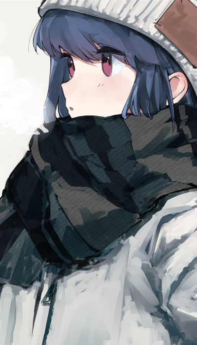

# Hello there, I am B3TsT👋

 

<!-- ## My tech stack -->
<h2> / About me /</h2>

- ⭐ currently working on **flutter-development**
- 💀 mostly working on **private repositories**
- 👾 a **student** working his way around things

## / Flutter Skills /
- Advance level in dart and flutter.
- State management with Provider, BLoC and Riverpod.
- Building high quality code with clean architecture and hexagonal architecture.
- Unit, widget and integration testing.
- TDD
- CI && CD
  
<h2> / Current skills / </h2>

- <h4> Languages </h4>
    
    
    
    
    
    
    
    
    
    

  - <h5>Currently learning</h5>
    
    

- <h4> Designing tools </h4>
  

<!-- ## Connect with me:

  
  

 -->

-----

  
  
  
   
   
 

